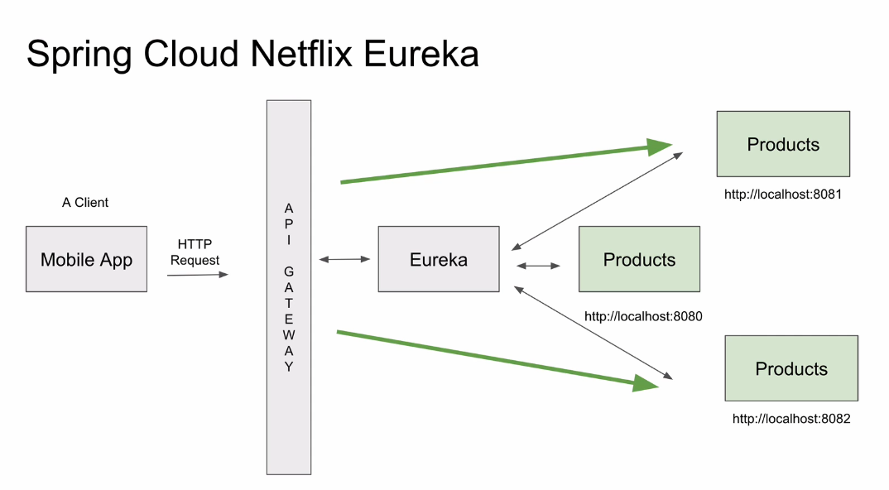
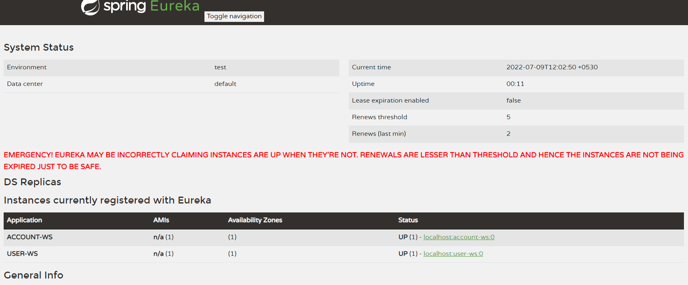
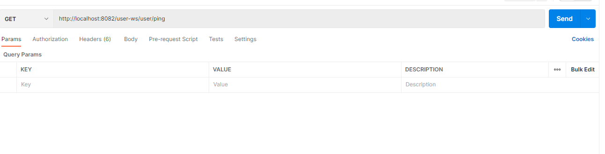
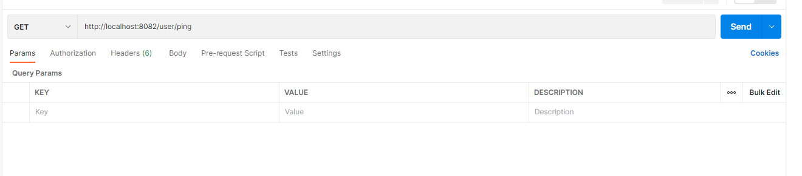
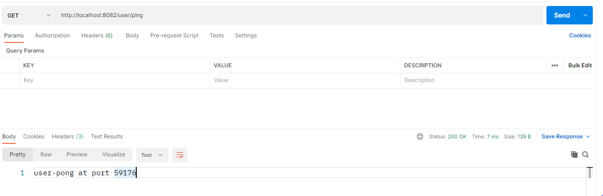

## Spring cloud notes

### Step 1 Spring eureka discover service

This service used to discover services of multiple instances



* create new springboot application named eurekadiscoveryserver with following dependecies are required

``````````````````````````````
Spring web 
Eureka Server  
Lombok 
``````````````````````````````

Following values added into application.properties

``````````````````````````
server.port=8010
spring.application.name=discoveryservice
eureka.client.registerWithEureka=false
eureka.client.fetchRegistry=false
eureka.client.serviceUrl.defaultZone=http://localhost:8010/eureka
``````````````````````````

finally make application as Eureka server by adding following annotation to main class

````````````````````````
@SpringBootApplication
@EnableEurekaServer
public class EurekadiscoveryserverApplication {

	public static void main(String[] args) {
		SpringApplication.run(EurekadiscoveryserverApplication.class, args);
	}

}
````````````````````````
### Step 2 create user-ws microservice 

create new user microservice with following dependencies 

``````````````````````````````
Spring web 
Eureka discovery client   
Lombok 
validations 
Spring Dev Tools 
``````````````````````````````

add following configurations to application.properties 

``````````````````````````
server.port=0
spring.application.name=user-ws
eureka.client.serviceUrl.defaultZone = http://localhost:8010/eureka
spring.devtools.restart.enabled=true
``````````````````````````

Now make user microservice as eureka client by adding following annotation to user-ws main class

````````````````````````````````
@SpringBootApplication
@EnableEurekaClient
public class UserWsApplication {

	public static void main(String[] args) {
		SpringApplication.run(UserWsApplication.class, args);
	}

}

````````````````````````````````

finally create User controller class with endpoint /user
````````````````````````````````
@RestController
@RequestMapping("/user")
public class UserController {

    @GetMapping("/ping")
    public String ping(){
        return "user-pong";
    }
}
``````````````````````````````````

#### same way create account-ws microservice
Now start 
 * discovery service 
 * user-ws
 * account-ws



Now dynamic URL generated and we can access user and account services as folllows
  * http://localhost:<dynamic_IP>/account/ping
  * http://localhost:<dynamic_IP>/user/ping

### Step 3 create cloud api gateway 

* create new springboot application named apigatway with following dependecies are required

``````````````````````````````
Spring web 
Eureka discovery client  
Lombok 
gateway
spring boot webflex
``````````````````````````````


add following configurations to application.properties

``````````````````````````
server.port=8082
spring.application.name=api-gateway
eureka.client.serviceUrl.defaultZone = http://localhost:8010/eureka
spring.cloud.gateway.discovery.locator.enabled=true
spring.cloud.gateway.discovery.locator.lower-case-service-id=true
``````````````````````````


Now make user microservice as eureka client by adding following annotation to user-ws main class

``````````````````````````````````
@SpringBootApplication
@EnableEurekaClient
public class ApigatewayApplication {

	public static void main(String[] args) {
		SpringApplication.run(ApigatewayApplication.class, args);
	}

}

``````````````````````````````````
Now start applications
 * eureka discovery service 
 * api gateway 
 * user-ws
 * account-ws

api-gateway now running 8082 port and user-ws access via api-gateway as 
````````````````````````
http://localhost:8082/user-ws/user/ping
``````````````````````````



### configure manual routes in apigateway to user ping GET API 

Update application property of apigateway module as follows

````````````````````````````````
server.port=8082
spring.application.name=api-gateway
eureka.client.serviceUrl.defaultZone = http://localhost:8010/eureka
spring.cloud.gateway.discovery.locator.enabled=true
spring.cloud.gateway.discovery.locator.lower-case-service-id=true

spring.cloud.gateway.routes[0].id= user-status-check
spring.cloud.gateway.routes[0].uri=lb://user-ws
spring.cloud.gateway.routes[0].predicates[0]=Path=/user/ping
spring.cloud.gateway.routes[0].predicates[1]=Method=GET
spring.cloud.gateway.routes[0].filters[0]=RemoveRequestHeader=Cookie

````````````````````````````````
Now user micro service can access via http://localhost:8082/user/ping



### How to run multiple user-ws instance 

1. update user-ws application.properties
``````````````````````````````
server.port=${PORT:0}
spring.application.name=user-ws
eureka.client.serviceUrl.defaultZone = http://localhost:8010/eureka
spring.devtools.restart.enabled=true
eureka.instance.instance-id=${spring.application.name}: ${spring.applcation.instance_id : ${random.value}}
   ``````````````````````````````
2. To verify add port information in user-ws controller 
``````````````````````````````
@RestController
@RequestMapping("/user")
public class UserController {

    @Autowired
    private Environment environment;

    @GetMapping("/ping")
    public String ping(){
        return "user-pong at port "+ environment.getProperty("local.server.port");
    }
}

``````````````````````````````
3. Now run 2 user-ws instances (from command line : mvn spring-boot:run)
4. Check via postman, application run from random instances 




